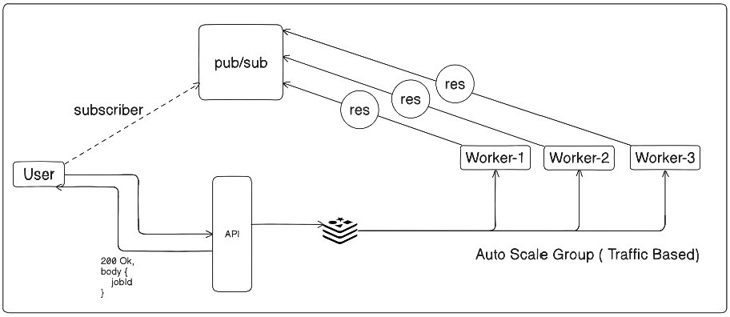

# Code Executor

A distributed, production-ready code execution platform that safely executes and returns code output across multiple programming languages. Built with a microservices architecture using Node.js, Redis, and Docker.

## Architecture



The system consists of three main components:

- **API Layer**: Express.js server handling job submissions and status queries
- **Message Queue**: Redis-based job queue for distributed processing
- **Worker Services**: Scalable workers that execute code in isolated environments

## Features

✨ **Multi-Language Support**
- Java, JavaScript, TypeScript, Python, Rust

🔄 **Async Job Processing**
- Non-blocking job submissions with UUID tracking
- Poll-based status checking system

🐳 **Docker Ready**
- Multi-stage builds for optimized images
- Docker Compose for local development

🔐 **CORS Protected**
- Whitelist-based origin validation
- Security-first approach

⚡ **Scalable Architecture**
- Horizontal scaling with multiple workers
- Redis message queue for job distribution
- 5-minute result caching

## Quick Start

### Prerequisites

- Node.js 20+
- Docker & Docker Compose (recommended)
- Redis (included in Docker Compose)

### Using Docker Compose

```bash
docker-compose up
```

This starts:
- Redis on `6379`
- API on `3000`
- Worker service

### Local Development

1. **Install dependencies:**
   ```bash
   npm install
   cd worker && npm install
   ```

2. **Start Redis:**
   ```bash
   redis-server
   ```

3. **Start API server:**
   ```bash
   npm run dev
   ```

4. **Start worker (in another terminal):**
   ```bash
   cd worker && npm run dev
   ```

## API Endpoints

### Submit Job

```bash
POST /set-job
Content-Type: application/json

{
  "user": "john_doe",
  "filename": "hello",
  "language": "python",
  "code": "print('Hello World')",
  "extension": "py"
}
```

**Response:**
```json
{
  "status": "push-success",
  "message": "Job submitted successfully",
  "data": {
    "jobId": "550e8400-e29b-41d4-a716-446655440000"
  }
}
```

### Check Job Status

```bash
GET /status/:jobId
```

**Pending Response:**
```json
{
  "status": "pending",
  "message": "Your Job is under Construction"
}
```

**Completed Response:**
```json
{
  "status": "pop-success",
  "message": "Job Execution Successful",
  "data": {
    "jobId": "550e8400-e29b-41d4-a716-446655440000",
    "response": {
      "status": "Success",
      "output": "Hello World"
    }
  }
}
```

## Supported Languages

| Language | Extension |
|----------|-----------|
| Java | `.java` |
| JavaScript | `.js` |
| TypeScript | `.ts` |
| Python | `.py` |
| Rust | `.rs` |

## Project Structure

```
code-executor/
├── src/
│   ├── index.ts          # API server
│   └── job.ts            # Job model
├── worker/
│   ├── src/
│   │   ├── index.ts      # Worker service
│   │   └── libs.ts       # Execution logic
│   ├── Dockerfile        # Worker container
│   ├── package.json      # Worker dependencies
│   └── tsconfig.json
├── docker-compose.yml    # Local environment setup
├── Dockerfile            # API container
├── package.json          # API dependencies
└── README.md
```

## Environment Variables

| Variable | Default | Description |
|----------|---------|-------------|
| `REDIS_URL` | `redis://localhost:6379` | Redis connection string |

## Development

### Build

```bash
npm run build
cd worker && npm run build
```

### Scripts

**API Layer:**
- `npm run dev` - Start with hot reload
- `npm run build` - Build TypeScript
- `npm start` - Run compiled code

**Worker:**
- `npm run build` - Build TypeScript
- `npm start` - Start worker

## Technical Stack

- **Runtime**: Node.js 20 (Alpine Linux)
- **Language**: TypeScript 5
- **API**: Express.js 5
- **Message Queue**: Redis 4
- **Container**: Docker & Docker Compose
- **Utilities**: UUID, CORS

## How It Works

1. Client submits code via `/set-job` endpoint
2. Job is serialized and pushed to Redis queue
3. Available worker picks up the job
4. Code is written to isolated file system
5. Language-specific command executes the code
6. Output is cached in Redis (10 minutes TTL)
7. Client polls `/status/:jobId` for results
8. Execution artifacts are cleaned up

## Execution Timeout

Code execution has a **5-second timeout** to prevent hanging processes.

## Result Caching

Job results are cached in Redis for **10 minutes** after completion.

## Contributing

Feel free to fork and submit pull requests for improvements.

## Author

**Saish Mungase**  
[@saishmungase](https://twitter.com/saishmungase)

## License

ISC
